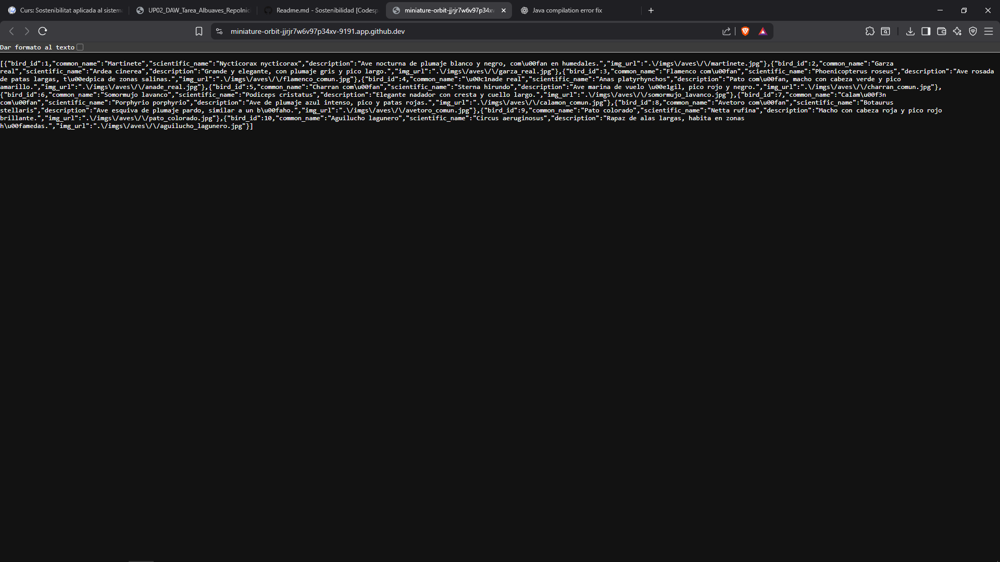
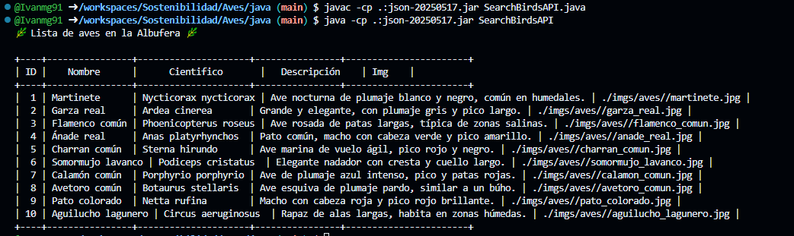

# Proyecto: AlbuAves

## 🔹 Descripción del Proyecto
Este proyecto consiste en una **API de aves** y un **cliente Java** que realiza peticiones GET a la API y muestra la información de manera estructurada en la terminal.  

Motivación del proyecto:  
- Practicar la integración entre **API web** y **aplicaciones Java**.  
- Gestionar datos JSON y mostrarlos en formato legible.  
- Familiarizarse con la infraestructura de desarrollo y pruebas de proyectos cliente-servidor.

---

## 🔹 Tecnologías Utilizadas
- **Lenguajes:** PHP (API), Java (cliente)  
- **Bibliotecas/Dependencias:** 
  - Java: `org.json` (JSON parsing)  
  - PHP: php-sqlite3 
- **Base de datos:** sqlitebrowser 
- **Otras herramientas:**  
  - Terminal/CLI para ejecución de Java  
  - Navegador para pruebas de la API  


---

## 🔹 Capturas de Funcionamiento

### 1. Llamada a la API en el navegador


### 2. Cliente Java ejecutándose en la terminal


---

## 🔹 Infraestructura y Scripts de Desarrollo

### 1. Puesta en marcha del Servidor
Comandos para levantar el servidor local de PHP:
```bash
# Instalar depencencias
sudo apt install sqlitebrowser php-sqlite3

# Desde la carpeta donde está api.php
php -S 127.0.0.1:9191 api.php
```

### 2. Puesta en marcha del Cliente
```bash
# Compilar y ejecutar el archivo del cliente
javac -cp .:json-20250517.jar SearchBirdsAPI.java
java -cp .:json-20250517.jar SearchBirdsAPI
```
